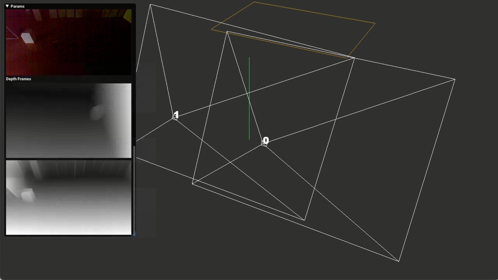
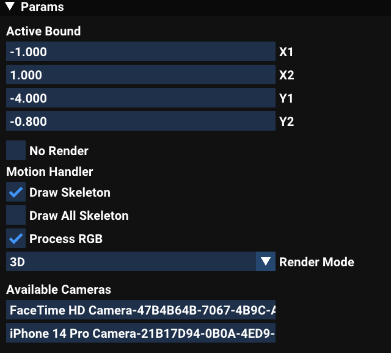
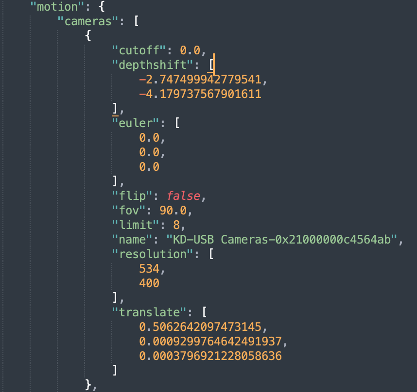
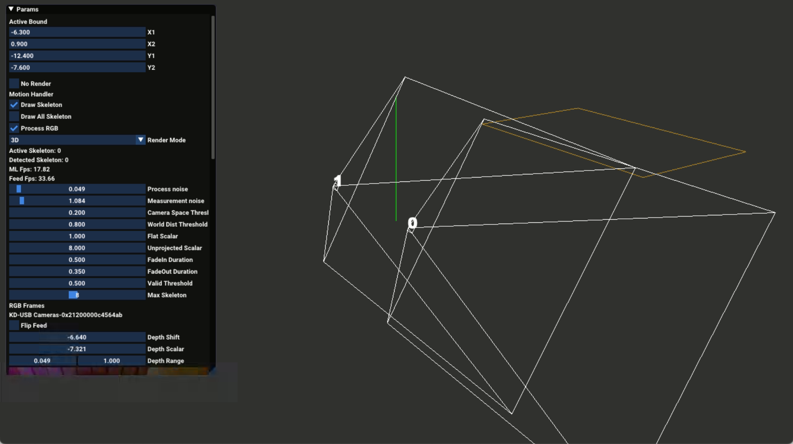
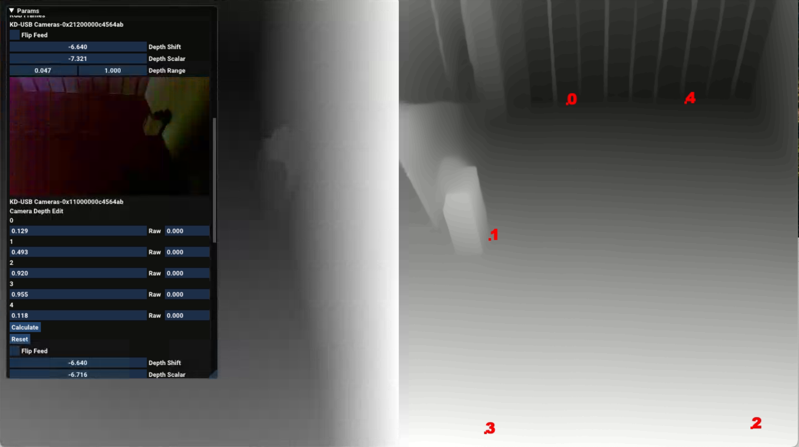

### Motion Tracker

This project aims at provide a low-cost, yet robust, skeleton tracking system for art installations in a bright environment with relatively stable light conditions.  

While infrared cameras support only short distances (usually less than 4.5m), and stereo cameras like Zed/Intel costs huge computation power (presumably the CNN models for depth estimation are not that GPU-friendly); and they are both quite pricey - this project relies solely on deep learning based approaches with cheap hardware and provide acceptable tracking results.  

This C++ Mac based project, uses builtin Mac OS vision 2d skeleton tracking, and [DepthAnythingV2](https://github.com/DepthAnything/Depth-Anything-V2) for depth estimation, and streams out skeleton data through OSC packets. It provides a spatial tracking solution that runs stably on Mac devices such as Mac Mini - ideal for installations.  

This tool has already been used in exhibitions, and it is proven that with stable light conditions (i.e. indoor), DepthAnythingV2, although relative, produces stable results. So even without fine tuning the model to get metric results for specific sites, we could use a linear regression method to map the relative depth to absolute values.  

##### Performance 

Tested with 2 cameras (resolution 1270x800) on:  
1. <b>M1 Pro</b> macbook pro, 32GB - <b>12fps</b>   
2. <b>M4</b> mac mini, 16GB - <b>17fps</b>  
  
Tested with 4 cameras (resolution 960x540) on:  
1. <b>M1 Max</b> mac studio, 32GB - <b>12fps</b>  

For debug purposes, the skeletons are rendered in the app by default, by ticking <b>No Render</b> option in the UI, a few more frames could be saved. Or you can also modify the code to remove the overhead: currently when rendering, the shared skeleton between the main and machine learning thread is locked. 

##### Build
A [build](http://solid-jellyfish.com/download/MotionTrackerBuild.zip) can be downloaded.
The app supports MacOS 14.0+ because of the use of DepthAnything model.

##### Instruction

<b>1. app structure</b>  
The app uses a <b>settings.json</b> to define the camera settings, a boundary for detection and OSC destination / port. It also uses a <b>cameradata.json</b> that defines the coeff/intrinsic camera data for reprojection, if this file is not found, a default coeff will be generated. 

Because of the [mobile OpenCV2](https://github.com/nihui/opencv-mobile) framework included in this project do not include the calibration lib, the camera calibration process is not supported - if there is prebuilt Arm OpenCV lib I will consider integrate it into this app. You can calibrate your cameras outside this app and copy the parameters over to the json file.

<b>2. adding new cameras</b>   
After opening the app, when no camera is found, available camera IDs will be shown in the UI:

The camera ID contain 2 parts - the actual camera name, and an unique ID bound to the USB port.
If you use different cameras, just using the camera name is enough, otherwise you will need to the full ID to <b>settings.json</b> and create a new block under <i>motion/cameras</i> section:

using the camera ID you have.  

In this block, <b>cutoff</b>, <b>depthshift</b>, <b>flip</b> can be edited in the app. But you will need to manually set <b>euler</b> for rotation, <b>fov</b> for camera's horizontal fov, <b>limit</b> for how many skeletons allowed per each camera, <b>resolution</b> for the desired feed resolution, and <b>translate</b> for the position of the camera.

If camera is succesfully pickedup, you should see a fustum being rendered:

<b>3. calibrate depth mapping</b>  
Changing <b>Render Mode</b> to <b>Depth</b>, you will see the depth textures of all cameras, drawn horizontally:

By right click on a depth feed, you will enter the depth edit mode:
the point on the feed will be marked and its depth value is shown in the UI, by measuring its absolute value (meter unit recommended) and input it into the <b>Raw</b> field in the UI a pair is made. To get an accurate result, you probably need more than 4 points. Please note that there is a bug right now that the camera rotation is flipped, you will need to input negative values of the absolute depth to get the correct results - i.e. if the point in the depth feed is <b>5m</b> away from the camera, you will need to input <b>-5</b> in the <b>Raw</b> field.

After enough points paired, click <b>Calculate</b> button, the mapping parameters - <b>Depth Shift</b> and <b>Depth Scalar</b> are calculated. Then click <b>Reset</b> to clear the points - and resume depth feed processing. You can change back to 3d view to test the skeleton position. 

<b>4. boundary clip</b>  

Only the skeletons within the bound area will be considered valid and streamed. You can edit its range in the <b>Active Bound</b> section in the UI. 

<b>5. save changes</b>

Press <b>Cmd + S</b> to save the changes to <b>settings.json</b>.

##### Dependency

You do not need these dependencies if you are using the build provided above.  

[Cinder](https://github.com/seph14/Cinder)  
This is custom Cinder fork of mine that has a few improvements to the camera capture process on Mac. 
Download this repository, put it the same root folder as this repository, opens proj/xcode/cinder.xcodeproj file, and build target for macos. If you have issues with the build process, please refer to Cinder's own repo or its website.

Please note that it seems <b>zlib</b> (used by Cinder) has a compatibility issue with Xcode 16.3, you will need to download Xcode 16.2 or previous versions - can be downloaded through your Apple developer account portal.

The project also uses [nlohmann json](https://github.com/nlohmann/json) v3.5.0, [mobile OpenCV2](https://github.com/nihui/opencv-mobile) and are included in the source code.

##### License
MIT

##### Contribution
If you want to improve this project, feel free to fork and change on your own.

Cinder is used to create the app instance, provide an OpenGL rendering environment and some other file I/O utility functions. If needed, it should be easy to replace with other c++ or Objective-c environments. 

